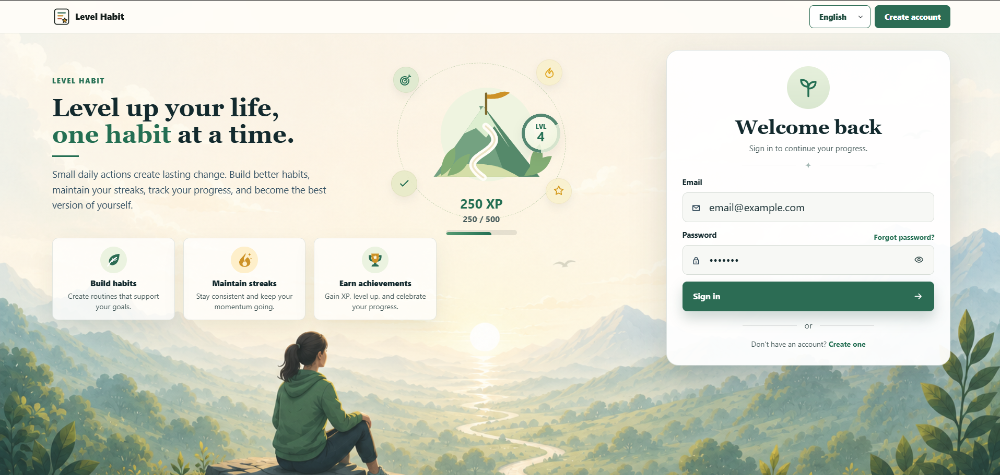
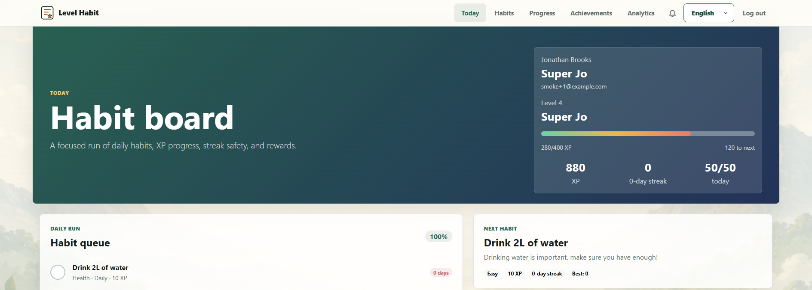
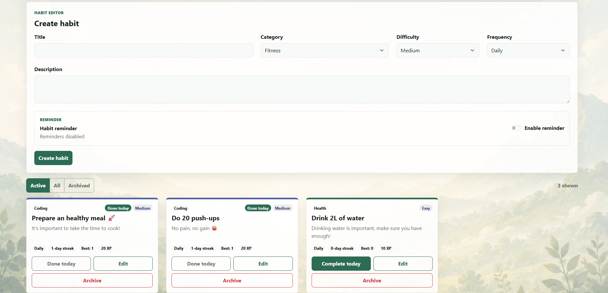
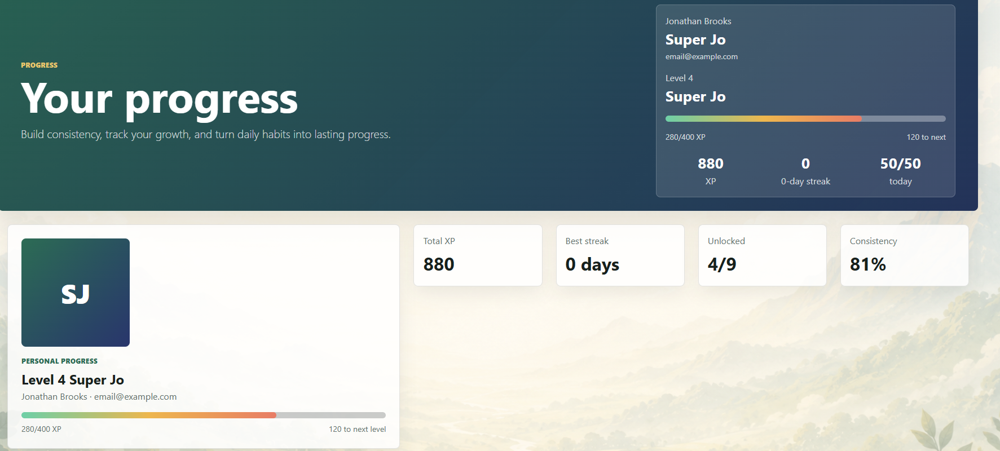
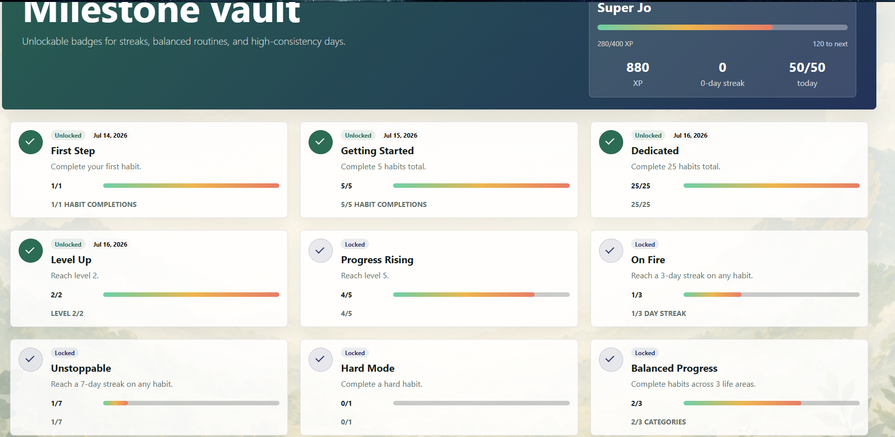
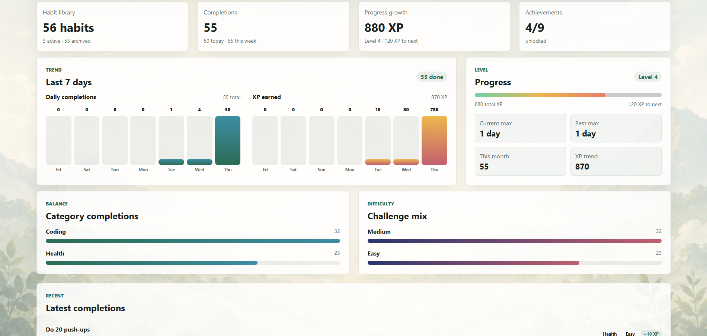

# Level Habit

Level Habit is a full-stack habit tracker that turns daily progress into a game.
Users can create habits, earn XP, build streaks, unlock achievements, and track their progress over time.

- [Create your own account today!](https://nicolasfrechette91.github.io/LevelHabit/)
- [API health check](https://level-habit-api.onrender.com/api/health)

## Feature

- Create, edit, complete, and archive daily habits.
- Earn XP and level up by completing habits.
- Build streaks based on completion history.
- Unlock achievements as progress milestones are reached.
- View recent completion, XP, streak, and activity analytics.
- Configure habit reminders and receive in-app notifications.
- Enable browser notifications while the application is open.
- Register with six-digit email verification.
- Reset forgotten passwords through one-time email links.
- Stay signed in through secure refresh-token rotation.
- Access only the habits, progress, achievements, reminders, notifications, and analytics associated with the signed-in account.

## Technical Highlights

- Angular single-page application with protected routes and responsive layouts.
- ASP.NET Core Web API with user-scoped services and endpoints.
- Short-lived JWT access tokens with rotating refresh tokens and server-side revocation.
- One-time tokens for email verification and password resets.
- Entity Framework Core migrations for local and production PostgreSQL databases.
- Automated backend, frontend, accessibility, authentication, and production E2E tests.
- GitHub Actions workflows for validation and frontend deployment.
- Render deployment hooks for backend releases.
- Frontend API warmup to reduce delays caused by Render cold starts.

## Tech Stack

- Angular 21, TypeScript, Angular Router, Angular HTTP client, SCSS, Bootstrap and Playwright.
- ASP.NET Core Web API on .NET 10.
- Entity Framework Core with the Npgsql PostgreSQL provider.
- Docker Compose for local PostgreSQL.
- Neon-hosted PostgreSQL in production.
- GitHub Pages for the production frontend.
- Render for the production backend API.
- GitHub Actions for CI/CD

## Screenshots
Login Page:

Tasks of the day:

Your list of habits:

Your progress:

Your achievements:

More stats:

## CI/CD And Deployment Notes

GitHub Actions runs on pull requests, pushes, and manual `workflow_dispatch`
runs.

- Backend job: restore, build, and test
  `backend/LevelHabit.Api.Tests/LevelHabit.Api.Tests.csproj`.
- Frontend job: `npm ci`, Angular unit tests, and production build with
  `--base-href /LevelHabit/`.
- Deploy job: publishes the built Angular artifact to GitHub Pages on `main`
  and manual runs.
- Render deploy job: triggers the Render backend deploy hook on `main` and
  manual runs when `RENDER_DEPLOY_HOOK_URL` is configured as a GitHub secret.
- EF Core migrations are applied with `dotnet ef database update`; the workflow
  does not automatically run production database migrations.