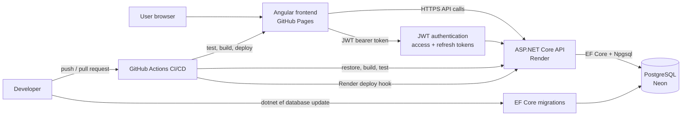

# Level Habit

Level Habit is a production-deployed gamified habit tracker. Users create daily
habits, complete them for XP, build streaks, unlock achievements, and level up
a personal progress profile.

- Live demo: [LevelHabit on GitHub Pages](https://nicolasfrechette91.github.io/LevelHabit/)
- API health check: [Render API health endpoint](https://level-habit-api.onrender.com/api/health)
- Case study: [docs/case-study.md](docs/case-study.md)
- Screenshot capture guide: [docs/screenshots.md](docs/screenshots.md)

## At A Glance

LevelHabit is built as a real full-stack MVP rather than a static prototype. It
combines an Angular frontend, an ASP.NET Core API, PostgreSQL persistence,
JWT-based authentication, EF Core migrations, automated tests, and CI/CD-backed
production deployment.

The core product loop is intentionally simple: create habits, complete them
daily, earn XP, maintain streaks, unlock achievements, and inspect progress in
the analytics view.

## Feature Summary

- Registration with six-digit email verification, login, logout, short-lived
  JWT access tokens, refresh-token rotation, password reset, protected API
  endpoints, and authenticated frontend routes.
- User-scoped habits with create, update, archive, and complete-today flows.
- Habit reminders, in-app notifications, a notification center, and optional
  browser notifications while the app is open.
- XP rewards, level progression, streak calculations, and achievement
  unlocks based on completion history.
- Analytics summary data for recent completions, XP, streaks, and activity.
- Production backend health warmup from the frontend to reduce Render cold-start
  friction.
- Backend and frontend validation through GitHub Actions.

## Technical Highlights

- Production full-stack deployment across GitHub Pages, Render, and Neon
  PostgreSQL.
- User-scoped data isolation for habits, completions, achievements, progress
  profiles, analytics, reminders, and notifications.
- JWT authentication with access tokens, rotating refresh tokens, server-side
  token revocation, one-time auth tokens, route guards, and token-bearing HTTP
  requests.
- EF Core migrations for PostgreSQL schema changes in local and production
  environments.
- Gamified progression loop covering XP rewards, levels, streaks,
  achievements, and analytics.
- Automated backend and frontend tests.
- CI/CD workflow for validation, GitHub Pages deployment, and Render deploy
  hook triggering.
- Responsive Angular frontend with mobile polish work already applied.

## Tech Stack

- Angular 21, TypeScript, Angular Router, HTTP services, route guards, SCSS, and
  Bootstrap utilities.
- ASP.NET Core Web API on .NET 10.
- Entity Framework Core with the Npgsql PostgreSQL provider.
- PostgreSQL locally through Docker Compose.
- Neon-hosted PostgreSQL in production.
- GitHub Pages for the production frontend.
- Render for the production backend API.
- GitHub Actions for CI, frontend deployment, and Render deploy hook triggering.

## Architecture Overview



The Angular app is deployed as static assets on GitHub Pages with the
`/LevelHabit/` base href and hash routing. It calls the ASP.NET Core API hosted
on Render. The API validates JWT bearer tokens, rotates refresh tokens, enforces
CORS for known frontend origins, and uses EF Core migrations to manage the
PostgreSQL schema. Neon hosts the production PostgreSQL database, while Docker
Compose provides local PostgreSQL.

## Reminders And Notifications

Habit reminders are stored per authenticated user and habit. Each habit can have
at most one reminder configuration with an enabled flag, one local `HH:mm`
reminder time, an IANA timezone id such as `America/Toronto`, and selected days
of the week. The database stores the local wall-clock time separately from the
IANA timezone id, plus a UTC `NextTriggerAtUtc` value for efficient processing.
This keeps daylight-saving-time behavior correct without storing only a UTC
offset.

Reminder days are stored as a weekday bitmask. Invalid local times during a
spring daylight-saving transition are moved forward to the next valid local
minute. Ambiguous fall daylight-saving times consistently use the offset that
produces the later UTC occurrence.

The backend runs a scoped `BackgroundService` once per minute while the Render
API service is running. It finds due enabled reminders, locks due rows with
PostgreSQL `FOR UPDATE SKIP LOCKED`, confirms the habit still belongs to the
user and is not archived, creates an in-app notification, and advances the next
future trigger. Reminder notifications use a deterministic deduplication key:
`habit-reminder:{reminderId}:{scheduledUtcTimestamp}`. A unique database index
prevents duplicates for the same scheduled reminder occurrence.

Archived habits do not create future notifications. Archiving a habit disables
its reminder and clears its next trigger. Restoring a habit does not
automatically re-enable the previous reminder.

In-app notifications are stored in Level Habit and shown in the authenticated
header notification center. Browser notifications are optional and require the
user to click `Enable browser notifications`. They use the browser
Notifications API only while Level Habit is open. This version does not implement
service workers, background web push, email, SMS, Firebase, SignalR, Hangfire,
Quartz, Redis, snoozing, or multiple reminder times per habit.

Render limitation: reminders are processed only while the backend service is
awake and running. If Render sleeps or the service is stopped, due reminders are
not processed until the API runs again. When processing resumes, Level Habit
creates an in-app notification for the due occurrence it sees and schedules the
next future occurrence.

## Case Study

The full write-up is available in [docs/case-study.md](docs/case-study.md). It
covers the product problem, architecture, backend and frontend design, database
model, authentication and security decisions, testing strategy, deployment
approach, key challenges, and next improvements.

## Screenshots

Screenshots are not committed yet. Capture real screenshots from the production
deployment with a demo account and non-sensitive sample data, then save them
under `docs/screenshots/`.

Expected screenshot paths:

| View | Path |
| --- | --- |
| Login or register | `docs/screenshots/login.png` |
| Dashboard with progress | `docs/screenshots/dashboard.png` |
| Habits with a completed habit | `docs/screenshots/habits.png` |
| Achievements with at least one unlock | `docs/screenshots/achievements.png` |
| Analytics with real activity data | `docs/screenshots/analytics.png` |
| Mobile dashboard | `docs/screenshots/mobile-dashboard.png` |

After those PNG files exist, replace this placeholder table with Markdown image
tags or a compact gallery. See [docs/screenshots.md](docs/screenshots.md) for
capture sizes, sample data setup, naming, and privacy reminders.

## Repository Structure

```text
.
|-- backend/
|   |-- LevelHabit.Api/
|   |   |-- Controllers/
|   |   |-- Data/
|   |   |-- Domain/
|   |   |-- Migrations/
|   |   |-- Services/
|   |   `-- Program.cs
|   `-- LevelHabit.Api.Tests/
|-- docs/
|   |-- case-study.md
|   |-- e2e-testing.md
|   |-- refresh-token-auth.md
|   `-- screenshots.md
|-- frontend/
|   |-- public/
|   `-- src/
|       |-- app/
|       `-- environments/
|-- .github/workflows/
|-- docker-compose.yml
|-- .env.example
`-- global.json
```

## Prerequisites

- .NET 10 SDK.
- Node.js 20.19 or newer with npm.
- Docker Desktop or another Docker Compose compatible runtime.
- Git.
- EF Core CLI for migration commands:

```powershell
dotnet tool install --global dotnet-ef
```

## Local Development Setup

Create the local Docker environment file:

```powershell
Copy-Item .env.example .env
```

Start PostgreSQL:

```powershell
docker compose up -d
docker compose ps
```

Configure backend secrets for local development:

```powershell
cd backend\LevelHabit.Api
dotnet user-secrets set "ConnectionStrings:DefaultConnection" "Host=localhost;Port=5432;Database=levelhabit;Username=levelhabit;Password=levelhabit_dev_password"
dotnet user-secrets set "Jwt:Secret" "replace-with-at-least-32-random-characters"
dotnet user-secrets set "Jwt:Issuer" "LevelHabit.Api"
dotnet user-secrets set "Jwt:Audience" "LevelHabit.Frontend"
dotnet user-secrets set "Jwt:ExpirationMinutes" "15"
dotnet user-secrets set "Jwt:RefreshTokenExpirationDays" "30"
dotnet user-secrets set "Email:Provider" "Development"
dotnet user-secrets set "EmailVerification:CodeExpirationMinutes" "10"
dotnet user-secrets set "EmailVerification:ResendCooldownSeconds" "60"
dotnet user-secrets set "EmailVerification:MaximumFailedAttempts" "5"
dotnet user-secrets set "Frontend:BaseUrl" "http://localhost:4200"
```

`Email:Provider=Development` is safe for local development only. It logs
password reset links and email verification codes to the backend console. To
test real Brevo delivery locally, set `Email:Provider` to `Brevo` and add:

```powershell
dotnet user-secrets set "BREVO_API_KEY" "replace-with-brevo-api-key"
dotnet user-secrets set "BREVO_SENDER_EMAIL" "your-verified-sender-email"
dotnet user-secrets set "BREVO_SENDER_NAME" "LevelHabit"
```

Apply local EF Core migrations and run the backend:

```powershell
dotnet ef database update
dotnet run --launch-profile http
```

Check the local API:

```powershell
Invoke-RestMethod http://localhost:5118/api/health
```

In a second terminal, install frontend dependencies and run Angular:

```powershell
cd frontend
npm ci
npm start
```

Local service URLs:

- Frontend: `http://localhost:4200`
- Backend: `http://localhost:5118`
- PostgreSQL: `localhost:5432`

## Environment Variable Notes

- Root `.env` values are used only by Docker Compose for local PostgreSQL.
- Local backend secrets belong in .NET user-secrets or temporary environment
  variables, not in source control.
- `backend/LevelHabit.Api/appsettings.json` contains safe defaults and empty
  secret placeholders.
- `backend/LevelHabit.Api/appsettings.Example.json` shows the backend
  configuration shape.
- `frontend/src/environments/environment.development.ts` points Angular to
  `http://localhost:5118/api`.
- `frontend/src/environments/environment.ts` points production builds to
  `https://level-habit-api.onrender.com/api`.
- Sentry error tracking is optional. Empty DSN values leave tracking disabled.
- Backend CORS must allow the exact production frontend origin:
  `https://nicolasfrechette91.github.io`.
- Credentialed authentication CORS must remain enabled with explicit origins;
  never combine `AllowCredentials` with a wildcard origin.
- Refresh-token behavior is documented in
  [docs/refresh-token-auth.md](docs/refresh-token-auth.md).
- Password reset and email verification use Brevo transactional email when
  `Email:Provider` is `Brevo`. In Development only, `Email:Provider=Development`
  logs password reset links and six-digit verification codes to the console.
- Verification codes expire after 10 minutes by default, use a 60-second resend
  cooldown, and are stored only as hashes.

Temporary PowerShell environment variables can be used for a single backend
session:

```powershell
$env:ConnectionStrings__DefaultConnection = "Host=localhost;Port=5432;Database=levelhabit;Username=levelhabit;Password=levelhabit_dev_password"
$env:Jwt__Secret = "replace-with-at-least-32-random-characters"
$env:Jwt__Issuer = "LevelHabit.Api"
$env:Jwt__Audience = "LevelHabit.Frontend"
$env:Jwt__ExpirationMinutes = "15"
$env:Jwt__RefreshTokenExpirationDays = "30"
$env:Email__Provider = "Development"
$env:EmailVerification__CodeExpirationMinutes = "10"
$env:EmailVerification__ResendCooldownSeconds = "60"
$env:EmailVerification__MaximumFailedAttempts = "5"
$env:Frontend__BaseUrl = "http://localhost:4200"
```

For local Brevo delivery, use `Email__Provider=Brevo` and add:

```powershell
$env:BREVO_API_KEY = "replace-with-brevo-api-key"
$env:BREVO_SENDER_EMAIL = "your-verified-sender-email"
$env:BREVO_SENDER_NAME = "LevelHabit"
```

Render backend environment variables:

```text
ConnectionStrings__DefaultConnection=Host=<neon-host>;Port=5432;Database=<database>;Username=<username>;Password=<password>;SSL Mode=Require;Trust Server Certificate=true
Jwt__Secret=<at least 32 random characters>
Jwt__Issuer=LevelHabit.Api
Jwt__Audience=LevelHabit.Frontend
Jwt__ExpirationMinutes=15
Jwt__RefreshTokenExpirationDays=30
AuthCookies__RefreshTokenName=LevelHabit.Refresh
AuthCookies__CsrfTokenName=LevelHabit.Csrf
AuthCookies__Secure=true
AuthCookies__SameSite=None
Email__Provider=Brevo
EmailVerification__CodeExpirationMinutes=10
EmailVerification__ResendCooldownSeconds=60
EmailVerification__MaximumFailedAttempts=5
BREVO_API_KEY=<Brevo transactional email API key>
BREVO_SENDER_EMAIL=<verified sender email>
BREVO_SENDER_NAME=LevelHabit
Frontend__BaseUrl=https://nicolasfrechette91.github.io/LevelHabit
Cors__AllowedOrigins__0=https://nicolasfrechette91.github.io
Sentry__Dsn=<optional backend Sentry DSN>
Sentry__Environment=production
```

Do not commit real connection strings, JWT secrets, passwords, deploy hooks, or
tokens. Store production values in Render, Neon, GitHub secrets, or local
developer secret stores.

## Production Error Tracking

Level Habit uses Sentry for optional production error tracking in both the
ASP.NET Core API and Angular frontend. The app still starts and runs when no
DSN is configured.

Backend setup on Render:

```text
Sentry__Dsn=<backend Sentry DSN>
Sentry__Environment=production
```

Frontend setup for GitHub Pages:

- Add `LEVELHABIT_SENTRY_DSN` as a GitHub Actions secret for the frontend
  Sentry project.
- Optionally add `LEVELHABIT_SENTRY_ENVIRONMENT=production` as a GitHub Actions
  variable.
- Pull request validation and local builds do not require these values. When
  `LEVELHABIT_SENTRY_DSN` is missing, the workflow builds with tracking
  disabled.

What is captured:

- Backend unhandled exceptions handled by the API exception middleware, with
  environment, service name, request path, HTTP method, status code, exception
  type, message, and stack trace.
- Frontend uncaught Angular/browser errors, with environment, service name, and
  sanitized route/page context.

What is intentionally excluded or scrubbed:

- Request bodies, cookies, browser storage values, Sentry user context, console
  breadcrumbs, query strings, and request headers on frontend events.
- Backend request bodies, cookies, query strings, server name, user context,
  request headers, failed-request auto-capture, and Sentry log-event capture.
- Do not place passwords, access tokens, refresh tokens, JWT secrets, database
  secrets, database URLs, or connection strings in Sentry context, logs, commit
  history, Render logs, or GitHub Actions output.

Verification:

1. Run the backend locally without `Sentry__Dsn` and confirm it starts.
2. Run the frontend locally without `LEVELHABIT_SENTRY_DSN` and confirm it
   starts.
3. In a development or staging branch with a test DSN, temporarily trigger a
   safe exception from an existing protected code path or local-only test change.
4. Confirm the event appears in Sentry with sanitized path/route context.
5. Remove the temporary trigger before merging or deploying. Do not leave a
   public endpoint or UI control whose purpose is to throw errors.

## Database Migrations

Apply migrations locally against Docker PostgreSQL:

```powershell
cd backend\LevelHabit.Api
dotnet ef database update
```

Apply migrations to the Neon production PostgreSQL database before or during a
production release:

```powershell
cd backend\LevelHabit.Api
$env:ConnectionStrings__DefaultConnection = "Host=<neon-host>;Port=5432;Database=<database>;Username=<username>;Password=<password>;SSL Mode=Require;Trust Server Certificate=true"
$env:Jwt__Secret = "replace-with-at-least-32-random-characters"
$env:Frontend__BaseUrl = "https://nicolasfrechette91.github.io/LevelHabit"
$env:Email__Provider = "Brevo"
$env:BREVO_API_KEY = "<Brevo transactional email API key>"
$env:BREVO_SENDER_EMAIL = "<verified sender email>"
$env:BREVO_SENDER_NAME = "LevelHabit"
dotnet ef database update
```

Production reminder: the Neon database needs every EF migration in
`backend/LevelHabit.Api/Migrations`, including authentication, refresh tokens,
progress profiles, habits, habit completions, completion XP, achievements,
six-digit email verification, analytics-related tables, habit reminders, and
notifications. The reminders/notifications migration is
`20260714024351_AddHabitRemindersAndNotifications`.

## Testing Commands

Backend tests:

```powershell
dotnet test backend\LevelHabit.Api.Tests\LevelHabit.Api.Tests.csproj
```

Frontend unit tests and production builds:

```powershell
cd frontend
npm test
npm run build -- --configuration production
npm run build -- --configuration production --base-href /LevelHabit/
```

Local Playwright E2E tests:

```powershell
cd frontend
npm run e2e:install
npm run e2e
```

See [docs/e2e-testing.md](docs/e2e-testing.md) for the required local Docker,
backend API, migrations, and Playwright setup. The E2E suite is local/manual and
is not part of the required GitHub Actions workflow.

Markdown whitespace validation:

```powershell
git diff --check
```

## CI/CD And Deployment Notes

GitHub Actions runs on pull requests, pushes, and manual `workflow_dispatch`
runs.

- Backend job: restore, build, and test
  `backend/LevelHabit.Api.Tests/LevelHabit.Api.Tests.csproj`.
- Frontend job: `npm ci`, Angular unit tests, and production build with
  `--base-href /LevelHabit/`.
- Deploy job: publishes the built Angular artifact to GitHub Pages on `main`
  and manual runs.
- Render deploy job: triggers the Render backend deploy hook on `main` and
  manual runs when `RENDER_DEPLOY_HOOK_URL` is configured as a GitHub secret.
- EF Core migrations are applied with `dotnet ef database update`; the workflow
  does not automatically run production database migrations.

## Production Smoke Checklist

After Render deploys the backend and the Neon database has the current
migrations:

1. Open `https://nicolasfrechette91.github.io/LevelHabit/`.
2. Register a new demo account.
3. Confirm login is blocked until the email code is verified.
4. Enter the six-digit email verification code and confirm redirect to login.
5. Log in.
6. Create a habit.
7. Complete the habit.
8. Verify XP and level updates.
9. Verify streaks update.
10. Verify achievements unlock when criteria are met.
11. Verify analytics reflects completions and XP.
12. Log out and log in again.
13. Verify the same user data persists.
14. Create or log into a second account and verify user data is isolated.

## Known Limitations

- Refresh tokens use secure cross-site cookies between GitHub Pages and Render.
  Browsers or enterprise policies that block third-party cookies may prevent
  session restoration; a same-site custom API domain would avoid that class of
  restriction.
- Reminder limitations in this version: one reminder time per habit, selected
  weekday schedules only, no snoozing, no email/SMS/push providers, and browser
  notifications only while Level Habit is open.
- Charts are intentionally lightweight for the MVP analytics dashboard.
- Render cold starts can affect the first backend request after inactivity.
- Real portfolio screenshots still need to be captured and committed.

## Future Roadmap

- Richer reminder recurrence options after the first notification center
  version settles.
- Richer analytics charts and trend comparisons.
- Continued mobile layout and touch ergonomics polish.
- Broader end-to-end test coverage.
- Performance monitoring.

## Documentation

- [Portfolio case study](docs/case-study.md)
- [Screenshot capture guide](docs/screenshots.md)
- [End-to-end testing guide](docs/e2e-testing.md)
- [Refresh token authentication](docs/refresh-token-auth.md)
- [Angular frontend review notes](docs/frontend-angular-review.md)
- [C# backend instructions](docs/csharp-best-practices.instructions.md)
