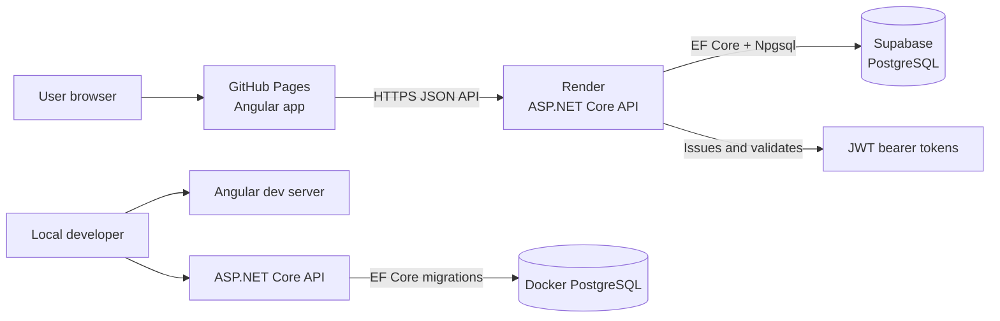

# LevelHabit

LevelHabit is a full-stack gamified habit tracker where users manage daily
habits as quests, complete them for XP, build streaks, unlock achievements, and
level up a personal hero profile over time.

The project exists to demonstrate a production-deployed, user-authenticated
application with a practical product loop, real persistence, automated tests,
and CI/CD. It is intentionally scoped as an MVP rather than a large habit
platform.

- Frontend: https://nicolasfrechette91.github.io/LevelHabit/#/dashboard
- API base URL: https://level-habit-api.onrender.com/api
- Case study: [docs/case-study.md](docs/case-study.md)

## Feature Checklist

- [x] Authentication
- [x] Hero profile
- [x] Quest/habit management
- [x] Daily completion tracking
- [x] XP rewards
- [x] Leveling
- [x] Streaks
- [x] Achievements
- [x] Analytics dashboard
- [x] User data isolation
- [x] Frontend validation
- [x] CI/CD
- [x] Production deployment

## Key Features

- Account registration, login, JWT-protected API access, and authenticated
  frontend routes.
- User-scoped quests with create, update, archive, and complete-today flows.
- XP rewards, hero level progression, streak calculations, and achievement
  unlocks based on completion history.
- Analytics summary data for recent completions, XP, streaks, and activity.
- Production frontend warmup call to the backend health endpoint to reduce the
  impact of Render cold starts.
- Automated backend and frontend validation through GitHub Actions.

## Tech Stack

- Angular 21 frontend with routing, route guards, HTTP services, and SCSS.
- ASP.NET Core Web API targeting .NET 10.
- Entity Framework Core with the Npgsql PostgreSQL provider.
- PostgreSQL locally through Docker Compose.
- Supabase PostgreSQL in production.
- GitHub Pages for the production frontend.
- Render for the production backend API.
- GitHub Actions for CI and frontend deployment.

## Architecture



The Angular app is deployed as a static GitHub Pages site using the
`/LevelHabit/` base href and hash routing. It calls the ASP.NET Core API hosted
on Render. The API validates JWT bearer tokens, applies CORS rules for the
production and local frontend origins, and uses EF Core migrations to manage
the PostgreSQL schema. Supabase provides the production database, while Docker
Compose provides a local PostgreSQL instance.

## Repository Structure

```text
.
|-- backend/
|   |-- LevelHabit.Api/
|   |   |-- Controllers/
|   |   |-- Data/
|   |   |-- Domain/
|   |   |-- Migrations/
|   |   |-- Services/
|   |   `-- Program.cs
|   `-- LevelHabit.Api.Tests/
|-- docs/
|-- frontend/
|   |-- public/
|   `-- src/
|       |-- app/
|       `-- environments/
|-- .github/workflows/
|-- docker-compose.yml
|-- .env.example
`-- global.json
```

## Screenshots

Screenshots are not committed yet. When they are captured, place production
screenshots at these paths and then embed them in this section:

```text
docs/screenshots/dashboard.png
docs/screenshots/quests.png
docs/screenshots/achievements.png
docs/screenshots/analytics.png
```

Recommended capture flow:

1. Open the deployed frontend.
2. Use a demo account with non-sensitive sample data.
3. Capture dashboard, quest management, achievements, and analytics views.
4. Save the PNG files under `docs/screenshots/`.
5. Update this section to use Markdown image tags after the files exist.

## Prerequisites

- .NET 10 SDK.
- Node.js 20.19 or newer with npm.
- Docker Desktop or another Docker Compose compatible runtime.
- Git.

## Local Development

Create the local Docker environment file:

```powershell
Copy-Item .env.example .env
```

Start PostgreSQL:

```powershell
docker compose up -d
docker compose ps
```

Configure backend secrets for local development:

```powershell
cd backend\LevelHabit.Api
dotnet user-secrets set "ConnectionStrings:DefaultConnection" "Host=localhost;Port=5432;Database=levelhabit;Username=levelhabit;Password=levelhabit_dev_password"
dotnet user-secrets set "Jwt:Secret" "replace-with-at-least-32-random-characters"
```

Apply local EF Core migrations:

```powershell
dotnet ef database update
```

Run the backend API:

```powershell
dotnet run --launch-profile http
```

Check the local health endpoint:

```powershell
Invoke-RestMethod http://localhost:5118/api/health
```

In a second terminal, install dependencies and run the frontend:

```powershell
cd frontend
npm install
npm start
```

Local services:

- Frontend: `http://localhost:4200`
- Backend: `http://localhost:5118`
- PostgreSQL: `localhost:5432`

## Configuration

- Root `.env` values are used by Docker Compose for PostgreSQL only.
- Local backend secrets belong in .NET user-secrets or temporary environment
  variables, not in source.
- `backend/LevelHabit.Api/appsettings.json` contains safe defaults and empty
  secret placeholders.
- `backend/LevelHabit.Api/appsettings.Example.json` shows the expected backend
  configuration shape.
- `frontend/src/environments/environment.development.ts` points Angular to
  `http://localhost:5118/api`.
- `frontend/src/environments/environment.ts` points production builds to
  `https://level-habit-api.onrender.com/api`.
- Backend CORS must allow the exact frontend origin:
  `https://nicolasfrechette91.github.io`.

For a single PowerShell session, temporary environment variables can be used
instead of user-secrets:

```powershell
$env:ConnectionStrings__DefaultConnection = "Host=localhost;Port=5432;Database=levelhabit;Username=levelhabit;Password=levelhabit_dev_password"
$env:Jwt__Secret = "replace-with-at-least-32-random-characters"
```

## Render Environment Variables

Set these on the Render backend service. Use real values from Supabase and a
long random JWT secret. Do not commit secrets.

```text
ConnectionStrings__DefaultConnection=<Supabase PostgreSQL connection string>
Jwt__Secret=<at least 32 random characters>
Jwt__Issuer=LevelHabit.Api
Jwt__Audience=LevelHabit.Frontend
Jwt__ExpirationMinutes=60
Cors__AllowedOrigins__0=https://nicolasfrechette91.github.io
Cors__AllowedOrigins__1=http://localhost:4200
```

If the Render service URL changes, update
`frontend/src/environments/environment.ts` before rebuilding and redeploying the
GitHub Pages frontend.

## Database Migrations

Install the EF Core CLI if needed:

```powershell
dotnet tool install --global dotnet-ef
```

Apply migrations locally against Docker PostgreSQL:

```powershell
cd backend\LevelHabit.Api
dotnet ef database update
```

Apply migrations to Supabase before or during a Render release:

```powershell
cd backend\LevelHabit.Api
$env:ConnectionStrings__DefaultConnection = "<Supabase PostgreSQL connection string>"
$env:Jwt__Secret = "replace-with-at-least-32-random-characters"
dotnet ef database update
```

Production reminder: Supabase needs every EF migration in
`backend/LevelHabit.Api/Migrations`, including authentication, hero profiles,
quests, quest completions, completion XP, achievements, and analytics-related
tables.

## Testing Commands

Backend tests:

```powershell
dotnet test backend\LevelHabit.Api.Tests\LevelHabit.Api.Tests.csproj
```

Frontend tests and production build:

```powershell
cd frontend
npm install
npm test
npm run build -- --configuration production
```

GitHub Pages production build:

```powershell
cd frontend
npm run build -- --configuration production --base-href /LevelHabit/
```

Documentation whitespace validation:

```powershell
git diff --check
```

## CI/CD

GitHub Actions runs on pull requests, pushes, and manual `workflow_dispatch`
runs.

- Backend job: restore, build, and test
  `backend/LevelHabit.Api.Tests/LevelHabit.Api.Tests.csproj`.
- Frontend job: `npm ci`, Angular unit tests, and production build with
  `--base-href /LevelHabit/`.
- Deploy job: publishes the built Angular artifact to GitHub Pages on `main`
  and manual runs.
- Render deploy job: triggers the Render backend deploy hook on `main` and
  manual runs when `RENDER_DEPLOY_HOOK_URL` is configured as a GitHub secret.

## Production Smoke Checklist

After Render deploys the backend and Supabase has the current migrations:

1. Open `https://nicolasfrechette91.github.io/LevelHabit/#/dashboard`.
2. Register a new account.
3. Log in.
4. Create a quest.
5. Complete the quest.
6. Verify XP and level updates.
7. Verify streaks update.
8. Verify achievements unlock when criteria are met.
9. Verify analytics reflects completions and XP.
10. Log out and log in again.
11. Verify the same user data persists.
12. Create or log into a second account and verify user data is isolated.

## Production Troubleshooting

- CORS failure: ensure `Cors__AllowedOrigins__0` on Render is exactly
  `https://nicolasfrechette91.github.io` with no path or trailing slash.
- Missing Supabase migration: run `dotnet ef database update` against the
  Supabase connection string and confirm all migrations are applied.
- Wrong API URL: confirm `frontend/src/environments/environment.ts` points to
  the Render API URL and the browser network tab calls that host.
- Expired or missing JWT: log out and log in again, then confirm API requests
  include an `Authorization: Bearer <token>` header.
- Render cold start: the first API request after inactivity can be slow; retry
  after the service wakes up.

## Known Limitations

- Password reset and email verification are not implemented.
- Access tokens are short-lived JWTs; refresh tokens are a future improvement.
- Notifications and reminders are not implemented.
- Charts are intentionally lightweight for the MVP analytics dashboard.
- Render cold starts can affect the first request after inactivity.
- Screenshots are not yet committed to the repository.

## Roadmap

Completed MVP:

- Authentication and hero profile.
- Quest and habit management.
- Daily completions with XP rewards.
- Leveling and streak calculations.
- Achievements.
- Analytics dashboard.
- User data isolation.
- Frontend validation.
- Backend and frontend automated tests.

Production polish:

- GitHub Pages frontend deployment.
- Render backend deployment.
- Supabase PostgreSQL production database.
- EF Core migration workflow.
- CI/CD for build, test, and deploy.
- Production smoke checklist.
- Backend health endpoint warmup from the auth page.

Future improvements:

- Password reset.
- Email verification.
- Refresh tokens.
- Notifications and reminders.
- Richer analytics charts.
- Mobile layout polish.
- Performance improvements.
- Broader end-to-end test coverage.

## Documentation

- [Portfolio case study](docs/case-study.md)
- [Angular frontend review notes](docs/frontend-angular-review.md)
- [C# backend instructions](docs/csharp-best-practices.instructions.md)
