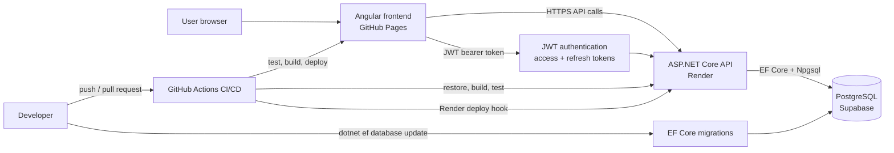

# LevelHabit

LevelHabit is a production-deployed gamified habit tracker. Users create daily
quests, complete them for XP, build streaks, unlock achievements, and level up
a personal hero profile.

- Live demo: [LevelHabit on GitHub Pages](https://nicolasfrechette91.github.io/LevelHabit/)
- API health check: [Render API health endpoint](https://level-habit-api.onrender.com/api/health)
- Case study: [docs/case-study.md](docs/case-study.md)
- Screenshot capture guide: [docs/screenshots.md](docs/screenshots.md)

## At A Glance

LevelHabit is built as a real full-stack MVP rather than a static prototype. It
combines an Angular frontend, an ASP.NET Core API, PostgreSQL persistence,
JWT-based authentication, EF Core migrations, automated tests, and CI/CD-backed
production deployment.

The core product loop is intentionally simple: create quests, complete them
daily, earn XP, maintain streaks, unlock achievements, and inspect progress in
the analytics view.

## Feature Summary

- Registration, login, logout, short-lived JWT access tokens, refresh-token
  rotation, protected API endpoints, and authenticated frontend routes.
- User-scoped quests with create, update, archive, and complete-today flows.
- XP rewards, hero level progression, streak calculations, and achievement
  unlocks based on completion history.
- Analytics summary data for recent completions, XP, streaks, and activity.
- Production backend health warmup from the frontend to reduce Render cold-start
  friction.
- Backend and frontend validation through GitHub Actions.

## Technical Highlights

- Production full-stack deployment across GitHub Pages, Render, and Supabase.
- User-scoped data isolation for quests, completions, achievements, hero
  profiles, and analytics.
- JWT authentication with access tokens, rotating refresh tokens, server-side
  token revocation, route guards, and token-bearing HTTP requests.
- EF Core migrations for PostgreSQL schema changes in local and production
  environments.
- Gamified progression loop covering XP rewards, hero levels, streaks,
  achievements, and analytics.
- Automated backend and frontend tests.
- CI/CD workflow for validation, GitHub Pages deployment, and Render deploy
  hook triggering.
- Responsive Angular frontend with mobile polish work already applied.

## Tech Stack

- Angular 21, TypeScript, Angular Router, HTTP services, route guards, SCSS, and
  Bootstrap utilities.
- ASP.NET Core Web API on .NET 10.
- Entity Framework Core with the Npgsql PostgreSQL provider.
- PostgreSQL locally through Docker Compose.
- Supabase PostgreSQL in production.
- GitHub Pages for the production frontend.
- Render for the production backend API.
- GitHub Actions for CI, frontend deployment, and Render deploy hook triggering.

## Architecture Overview



The Angular app is deployed as static assets on GitHub Pages with the
`/LevelHabit/` base href and hash routing. It calls the ASP.NET Core API hosted
on Render. The API validates JWT bearer tokens, rotates refresh tokens, enforces
CORS for known frontend origins, and uses EF Core migrations to manage the
PostgreSQL schema. Supabase provides the production database, while Docker
Compose provides local PostgreSQL.

## Case Study

The full write-up is available in [docs/case-study.md](docs/case-study.md). It
covers the product problem, architecture, backend and frontend design, database
model, authentication and security decisions, testing strategy, deployment
approach, key challenges, and next improvements.

## Screenshots

Screenshots are not committed yet. Capture real screenshots from the production
deployment with a demo account and non-sensitive sample data, then save them
under `docs/screenshots/`.

Expected screenshot paths:

| View | Path |
| --- | --- |
| Login or register | `docs/screenshots/login.png` |
| Dashboard with hero progress | `docs/screenshots/dashboard.png` |
| Quests with a completed quest | `docs/screenshots/quests.png` |
| Achievements with at least one unlock | `docs/screenshots/achievements.png` |
| Analytics with real activity data | `docs/screenshots/analytics.png` |
| Mobile dashboard | `docs/screenshots/mobile-dashboard.png` |

After those PNG files exist, replace this placeholder table with Markdown image
tags or a compact gallery. See [docs/screenshots.md](docs/screenshots.md) for
capture sizes, sample data setup, naming, and privacy reminders.

## Repository Structure

```text
.
|-- backend/
|   |-- LevelHabit.Api/
|   |   |-- Controllers/
|   |   |-- Data/
|   |   |-- Domain/
|   |   |-- Migrations/
|   |   |-- Services/
|   |   `-- Program.cs
|   `-- LevelHabit.Api.Tests/
|-- docs/
|   |-- case-study.md
|   |-- e2e-testing.md
|   |-- refresh-token-auth.md
|   `-- screenshots.md
|-- frontend/
|   |-- public/
|   `-- src/
|       |-- app/
|       `-- environments/
|-- .github/workflows/
|-- docker-compose.yml
|-- .env.example
`-- global.json
```

## Prerequisites

- .NET 10 SDK.
- Node.js 20.19 or newer with npm.
- Docker Desktop or another Docker Compose compatible runtime.
- Git.
- EF Core CLI for migration commands:

```powershell
dotnet tool install --global dotnet-ef
```

## Local Development Setup

Create the local Docker environment file:

```powershell
Copy-Item .env.example .env
```

Start PostgreSQL:

```powershell
docker compose up -d
docker compose ps
```

Configure backend secrets for local development:

```powershell
cd backend\LevelHabit.Api
dotnet user-secrets set "ConnectionStrings:DefaultConnection" "Host=localhost;Port=5432;Database=levelhabit;Username=levelhabit;Password=levelhabit_dev_password"
dotnet user-secrets set "Jwt:Secret" "replace-with-at-least-32-random-characters"
dotnet user-secrets set "Jwt:Issuer" "LevelHabit.Api"
dotnet user-secrets set "Jwt:Audience" "LevelHabit.Frontend"
dotnet user-secrets set "Jwt:ExpirationMinutes" "15"
dotnet user-secrets set "Jwt:RefreshTokenExpirationDays" "30"
```

Apply local EF Core migrations and run the backend:

```powershell
dotnet ef database update
dotnet run --launch-profile http
```

Check the local API:

```powershell
Invoke-RestMethod http://localhost:5118/api/health
```

In a second terminal, install frontend dependencies and run Angular:

```powershell
cd frontend
npm ci
npm start
```

Local service URLs:

- Frontend: `http://localhost:4200`
- Backend: `http://localhost:5118`
- PostgreSQL: `localhost:5432`

## Environment Variable Notes

- Root `.env` values are used only by Docker Compose for local PostgreSQL.
- Local backend secrets belong in .NET user-secrets or temporary environment
  variables, not in source control.
- `backend/LevelHabit.Api/appsettings.json` contains safe defaults and empty
  secret placeholders.
- `backend/LevelHabit.Api/appsettings.Example.json` shows the backend
  configuration shape.
- `frontend/src/environments/environment.development.ts` points Angular to
  `http://localhost:5118/api`.
- `frontend/src/environments/environment.ts` points production builds to
  `https://level-habit-api.onrender.com/api`.
- Backend CORS must allow the exact production frontend origin:
  `https://nicolasfrechette91.github.io`.
- Refresh-token behavior is documented in
  [docs/refresh-token-auth.md](docs/refresh-token-auth.md).

Temporary PowerShell environment variables can be used for a single backend
session:

```powershell
$env:ConnectionStrings__DefaultConnection = "Host=localhost;Port=5432;Database=levelhabit;Username=levelhabit;Password=levelhabit_dev_password"
$env:Jwt__Secret = "replace-with-at-least-32-random-characters"
$env:Jwt__Issuer = "LevelHabit.Api"
$env:Jwt__Audience = "LevelHabit.Frontend"
$env:Jwt__ExpirationMinutes = "15"
$env:Jwt__RefreshTokenExpirationDays = "30"
```

Render backend environment variables:

```text
ConnectionStrings__DefaultConnection=<Supabase PostgreSQL connection string>
Jwt__Secret=<at least 32 random characters>
Jwt__Issuer=LevelHabit.Api
Jwt__Audience=LevelHabit.Frontend
Jwt__ExpirationMinutes=15
Jwt__RefreshTokenExpirationDays=30
Cors__AllowedOrigins__0=https://nicolasfrechette91.github.io
Cors__AllowedOrigins__1=http://localhost:4200
```

Do not commit real connection strings, JWT secrets, passwords, deploy hooks, or
tokens. Store production values in Render, Supabase, GitHub secrets, or local
developer secret stores.

## Database Migrations

Apply migrations locally against Docker PostgreSQL:

```powershell
cd backend\LevelHabit.Api
dotnet ef database update
```

Apply migrations to Supabase before or during a production release:

```powershell
cd backend\LevelHabit.Api
$env:ConnectionStrings__DefaultConnection = "<Supabase PostgreSQL connection string>"
$env:Jwt__Secret = "replace-with-at-least-32-random-characters"
dotnet ef database update
```

Production reminder: Supabase needs every EF migration in
`backend/LevelHabit.Api/Migrations`, including authentication, refresh tokens,
hero profiles, quests, quest completions, completion XP, achievements, and
analytics-related tables.

## Testing Commands

Backend tests:

```powershell
dotnet test backend\LevelHabit.Api.Tests\LevelHabit.Api.Tests.csproj
```

Frontend unit tests and production builds:

```powershell
cd frontend
npm test
npm run build -- --configuration production
npm run build -- --configuration production --base-href /LevelHabit/
```

Local Playwright E2E tests:

```powershell
cd frontend
npm run e2e:install
npm run e2e
```

See [docs/e2e-testing.md](docs/e2e-testing.md) for the required local Docker,
backend API, migrations, and Playwright setup. The E2E suite is local/manual and
is not part of the required GitHub Actions workflow.

Markdown whitespace validation:

```powershell
git diff --check
```

## CI/CD And Deployment Notes

GitHub Actions runs on pull requests, pushes, and manual `workflow_dispatch`
runs.

- Backend job: restore, build, and test
  `backend/LevelHabit.Api.Tests/LevelHabit.Api.Tests.csproj`.
- Frontend job: `npm ci`, Angular unit tests, and production build with
  `--base-href /LevelHabit/`.
- Deploy job: publishes the built Angular artifact to GitHub Pages on `main`
  and manual runs.
- Render deploy job: triggers the Render backend deploy hook on `main` and
  manual runs when `RENDER_DEPLOY_HOOK_URL` is configured as a GitHub secret.
- EF Core migrations are applied with `dotnet ef database update`; the workflow
  does not automatically run production database migrations.

## Production Smoke Checklist

After Render deploys the backend and Supabase has the current migrations:

1. Open `https://nicolasfrechette91.github.io/LevelHabit/`.
2. Register a new demo account.
3. Log in.
4. Create a quest.
5. Complete the quest.
6. Verify XP and level updates.
7. Verify streaks update.
8. Verify achievements unlock when criteria are met.
9. Verify analytics reflects completions and XP.
10. Log out and log in again.
11. Verify the same user data persists.
12. Create or log into a second account and verify user data is isolated.

## Known Limitations

- Password reset and email verification are not implemented.
- Browser token persistence uses `localStorage` for the current GitHub
  Pages/Render architecture; a same-site deployment could move refresh tokens
  to httpOnly cookies later.
- Notifications and reminders are not implemented.
- Charts are intentionally lightweight for the MVP analytics dashboard.
- Render cold starts can affect the first backend request after inactivity.
- Real portfolio screenshots still need to be captured and committed.

## Future Roadmap

- Password reset and email verification.
- Notifications and reminders.
- Richer analytics charts and trend comparisons.
- Continued mobile layout and touch ergonomics polish.
- Broader end-to-end test coverage.
- Production error tracking and performance monitoring.

## Documentation

- [Portfolio case study](docs/case-study.md)
- [Screenshot capture guide](docs/screenshots.md)
- [End-to-end testing guide](docs/e2e-testing.md)
- [Refresh token authentication](docs/refresh-token-auth.md)
- [Angular frontend review notes](docs/frontend-angular-review.md)
- [C# backend instructions](docs/csharp-best-practices.instructions.md)
